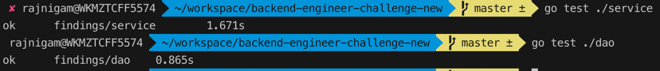
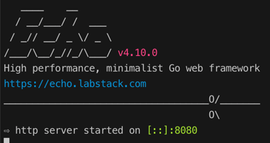
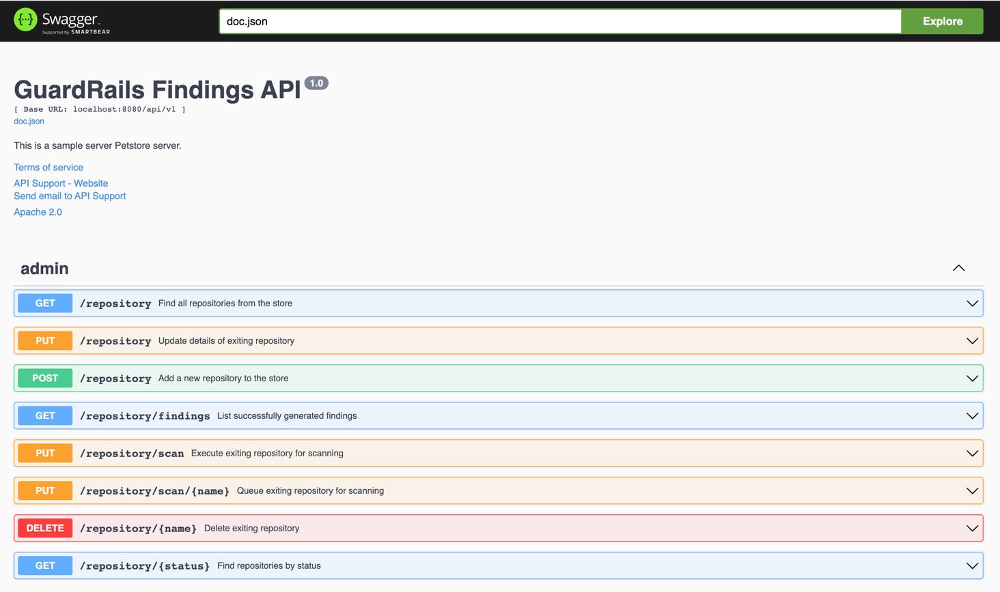
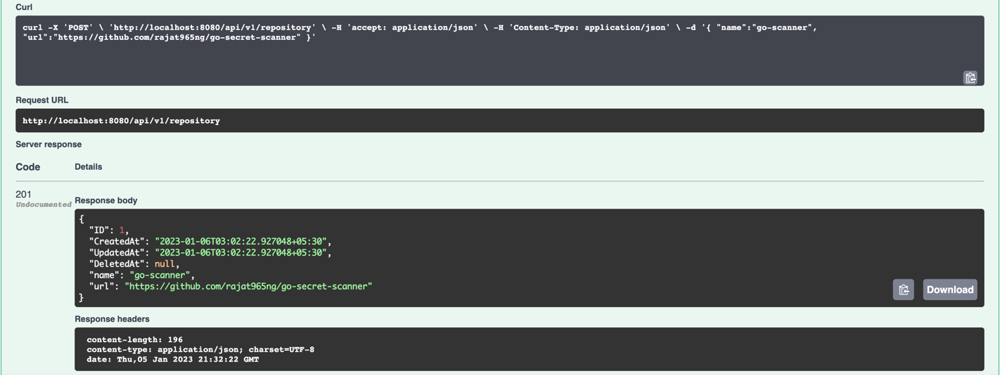
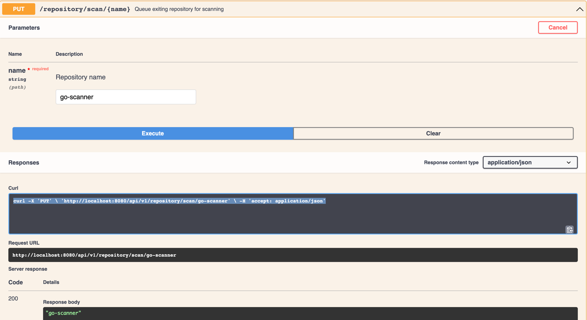
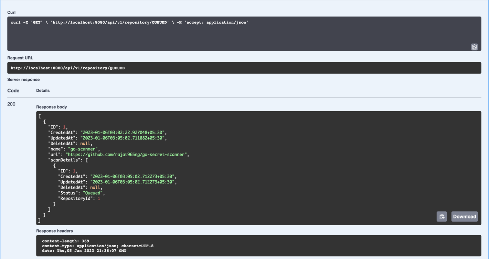
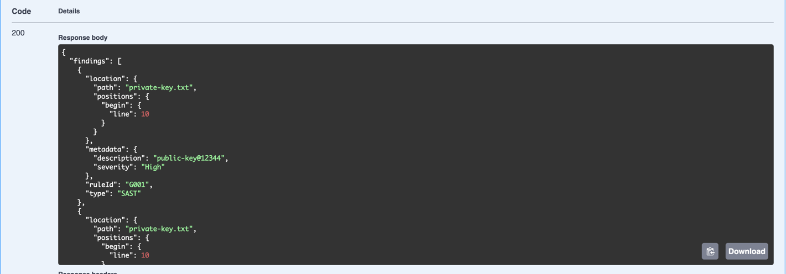
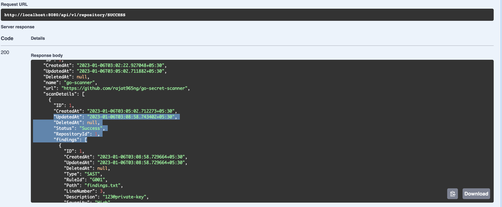

# GaurdRails

## Tech stack Info
- Echo (Go web framework)
- Gorm (ORM library for Golang)
- SqlLite (SQL database engine)
- Swaggo (API Documentation)

## Clone the application
- `git clone https://github.com/rajat965ng/GaurdRails.git`
- `cd GaurdRails`

## Execute the unit test cases
- `go test ./service`
- `go test ./dao`

## Start the application on port 8080
- `go run main.go`

## Open the browser and access api docs 
- `http://localhost:8080/api/v1/swagger/index.html`

## Add a new repository
- `curl -X 'POST' \ 'http://localhost:8080/api/v1/repository' \ -H 'accept: application/json' \ -H 'Content-Type: application/json' \ -d '{ "name":"go-scanner", "url":"https://github.com/rajat965ng/go-secret-scanner" }'`

## Queue the repository for scan
- `curl -X 'PUT' \ 'http://localhost:8080/api/v1/repository/scan/go-scanner' \ -H 'accept: application/json'`

## Search repositories Queued for scan
- `curl -X 'GET' \ 'http://localhost:8080/api/v1/repository/QUEUED' \ -H 'accept: application/json'`

## Execute scanning
- `curl -X 'PUT' \ 'http://localhost:8080/api/v1/repository/scan' \ -H 'accept: application/json'`

## View the findings
- curl -X 'GET' \ 'http://localhost:8080/api/v1/repository/findings' \ -H 'accept: application/json'

## Search successfully scanned repositories
- `curl -X 'GET' \ 'http://localhost:8080/api/v1/repository/SUCCESS' \ -H 'accept: application/json'`

